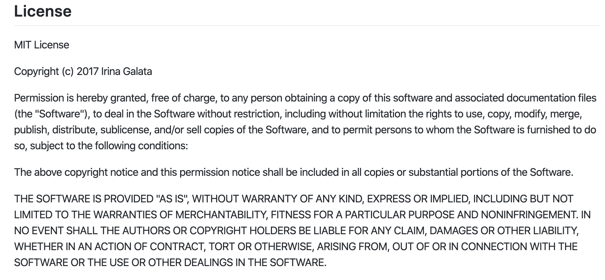

# group-project-2019-20-group-13-1
-Licensing

- API Documentation:

<b> POST /register:</b>

Takes user input for name, email and password

Encrypts password

Posts data to database

<b> POST /login:</b>

Takes user input for email and password

Logs user in

<b> GET /destinations:</b>

Displays all destinations

optional /id for specific country search

<b>GET /Search/keywords:</b>

Displays search results for keywords searched,

optional /keyword1/keyword2/keyword3 ; the user can search between 1 and 3 keywords

<b>GET /Weather:</b> 

search countries weather 

add /country1 for optional specific country weather search

<b> GET /Summary:</b>

search countries summary

add /country1 for optional specific country summary search

<b>GET /Attractions: </b>
search countries attractions

add /country1 for optional specific country summary search

<b> POST /rating: </b>

add user reviews to the database.

add /rating/comments 

rating : number of stars

comments: user feedback

- System Architecture:

- How to access the server:

1. Edit database IP address user and password from dbconfig.js

2.Make sure const dbcconfig in dbconnect.js is on the right path.

3.Make sure <b>Mysql1</b> in app.js is on the right path.

4.Make sure Nodejs is installed alongside Mysql, express, bodyParser, crypto and uuid 

--to install mysql and express run the following commands in the cmd (console commandline)

<b>npm install Mysql</b>

<b> npm install express</b>

<b>npm install bodyParser</b>

<b>npm install crypto</b>

<b>npm install uuid</b>

5. Finally, run the following in the cmd

<b>node app.js</b>

group-project-2019-20-group-13-1 created by GitHub Classroom

